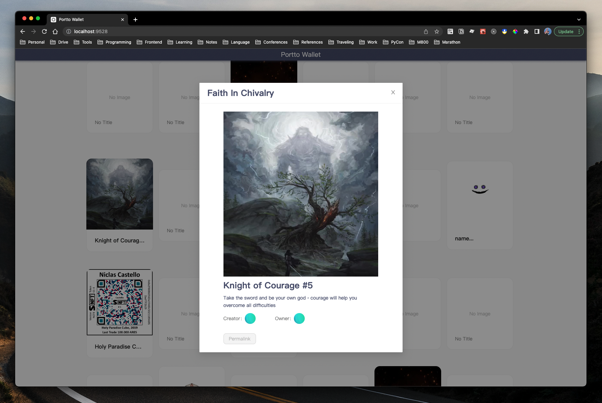

# Portto Wallet



This repository is my first practice to implement a crypto collectable wallet of ERC-721 on [OpenSea](https://opensea.io/assets/ethereum/0x4164692f986daea213ba582cfed9ec1155462107/0) using React and TypeScript. ✈️

> HINT: If you have any questions, please feel free to ask me.

---

## Description

### Execution

1. To run our production, you need to clone our project first
   ```bash
   $ git clone https://github.com/yungshenglu/Portto-Wallet/
   ```
2. After cloning, change the your current directory into the repository and setup the project
   ```bash
   $ cd Portto-Wallet/ & yarn install
   ```
   - The command `yarn install` will install some necessary packages for this project
   - It will take few second for running above command
3. Compiles and hot-reloads for development
   ```bash
   $ yarn start
   ```
   - It will take few second for running above command
   - This command will also start a proxy server on port `9527` to fetch the data from OpenSea
   - You won't get any error messages if running successful
4. Congratulation! you can open your browser to `http://localhost:9528` and see our Portto-Wallet

---

## Implementation

### CORS (Cross-Origin Resource Sharing)

> HINT: [CORS on Wiki](https://en.wikipedia.org/wiki/Cross-origin_resource_sharing)

- Implementing a simple **proxy server** to solve the CORS policy
   - Set the proxy server running on port `9527` via [Express](https://expressjs.com/)
   - You can see the detail of the implementation [here](./app.js)
- The default of the request mode in Express server is `mode: no-cors`
   - Use [CORS](https://www.npmjs.com/package/cors), a Node package for providing a Connect/Express middleware that can be used to enable CORS with various options
   - You can see the detail of the implementation [here](./app.js)
- In this repository, we only implement the following two APIs in our server: (The detail is in the following **APIs** section)
   - `/api/assets`: Fetch the list of the assets
   - `/api/assets&token=:token`: Fetch the content of the asset via the token

### Customize Hooks

> HINT: You can see the detail [here](./src/hooks)

- `useFetchAssetsList`: Fetch the list of the assets
   - There are two cases when triggering this API:
      - Case 1: Entering the page **first time**
      - Case 2: Loading more assets when **scrolling to the bottom** of the page
   - When entering the page **first time**, the parameter of `before` will be 0. After getting the response, do the followings:
      - Set the return data into `postList`
      - Set the status of loading into `false`
      - Set the status of having more assets into `true` as default
   - When **scrolling to the bottom** of the page, the parameter of `before` will NOT be 0. After getting the response, do the followings:
      - Append the new return data after existed `postList`
      - Set the status of loading into `false`
      - Set the status of having more assets into `true` as default
- `useFetchAssets`: Fetch the content the specific asset
   - Encapsulate the hook `useAxios` in [`axios-hooks`](https://www.npmjs.com/package/axios-hooks)
   - The only parameters is `postId` (Number) which is to get the content you want.
   - Set `manual: true` to avoid triggering the API when rendering
   - The only condition of triggering the API is clicking the asset on the list

### Infinite Scrolling

- Using **Intersection Observer API** to implement "Lazy Loading"
   - You can see the detail of the implementation [here](./src/views/Home/Home.tsx)
- The main concept is that we need to *observe the last item in the list whether is intersect with viewport*
   - When the last item is intersect with view port, we fetch new asset's list after it
   - Register the DOM of the last asset with **Intersection Observer** each time after fetching the list
   - Use `useCallback` to setup the callback function when the target DOM intersects with the viewport and start observing the target

---
## APIs

- GET: `/api/assets&offset=:offset`
   - Usage: Fetch the list of assets on OpenSea
   - Params:
      - `offset` (Number):
         - Return the assets after this offset
         - If `offset` is 0, it will seems to be the first fetching
   - URL:
      - `https://testnets-api.opensea.io/api/v1/assets`
- GET: `/api/assets&token=:token`
   - Usage: Fetch the content of the asset via this token on OpenSea
   - Params:
      - `token` (Number):
         - Return the content of the asset via this token
   - URL:
      - `https://testnets-api.opensea.io/api/v1/asset/${contactAddress}/${token}`

---

## Contributor

> NOTICE: You can follow the contributing process [CONTRIBUTING.md](CONTRIBUTING.md) to join me. I am very welcome for any issue!

- [David Lu](https://github.com/yungshenglu)

---

## License

[WTFPL](LICENSE)
